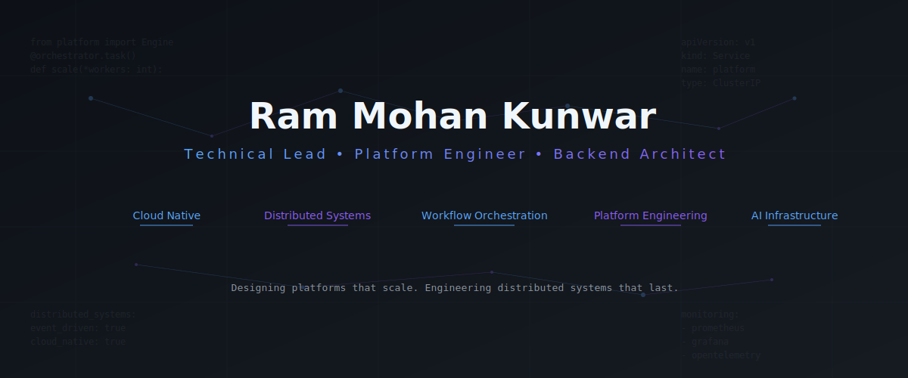
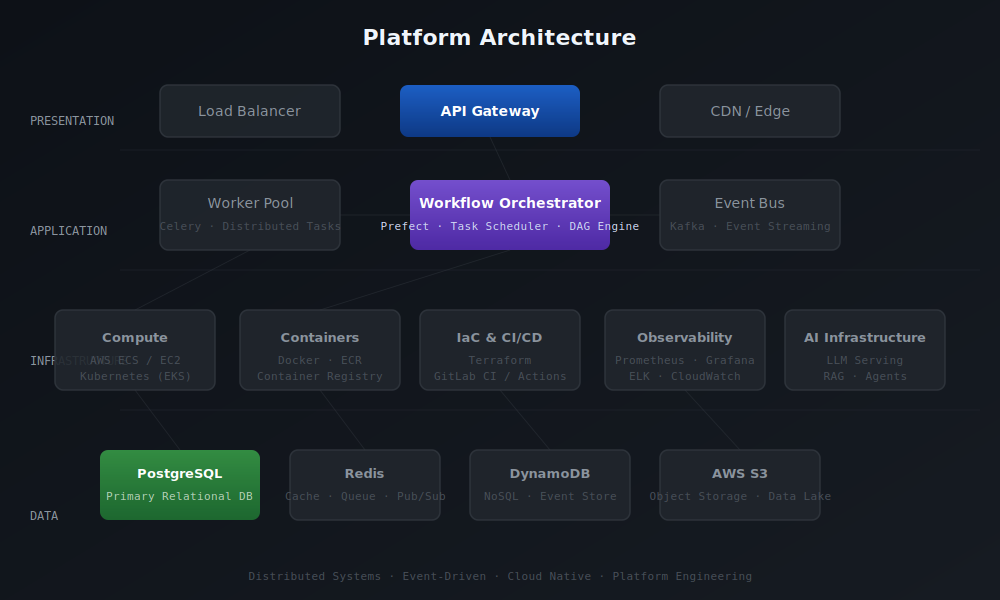

 

 

**Designing and operating distributed platforms that process millions of events daily.**

 

 

---

## About

Leading backend platform engineering for global telecom infrastructure at Eseye — architecting distributed systems that process 100M+ daily records across cloud-native AWS environments. The work spans event-driven architectures, workflow orchestration engines, and scalable APIs serving 50+ enterprise clients.

Operating at the intersection of backend architecture and AI infrastructure — exploring agentic workflows, context engineering, and LLM-powered developer tooling.

Building systems that stay reliable under scale — observable, maintainable, and designed to evolve through every iteration.

---

## Current Focus

`Platform Engineering` `Workflow Orchestration` `AI Agents` `Context Engineering` `Cloud Native Systems` `Backend Architecture`

---

## Engineering Principles

| | |
|---|---|
| **Simple > Clever** | Complexity compounds; simplicity scales |
| **Automation First** | If it runs more than once, automate it |
| **Cloud Native by Default** | Design for the platform, not against it |
| **Performance is a Feature** | Speed and reliability are inseparable |
| **Developer Experience Matters** | Internal platforms should accelerate, not frustrate |
| **Build for Scale** | Architect for 10x, plan for 100x |
| **Document Everything** | Knowledge trapped in someone's head is technical debt |

---

## Featured Projects

 

<table>
<tr>
<td width="50%">

### IoT Location Services

Processing **400K+ location feeds per minute** for 50+ enterprise clients. Reduced end-to-end latency from 15 seconds to under 2 seconds.

**Architecture:** Event ingestion → Kinesis stream processing → Lambda-based location resolution → DynamoDB → real-time API

**Stack:** `Python` `FastAPI` `AWS Lambda` `DynamoDB` `Kinesis` `API Gateway`

[*Details →*](https://rammohankunwar.com)

</td>
<td width="50%">

### Telecom CDR Pipeline

Processing **100M+ voice, data, and SMS records daily** with 99.9% data integrity SLA. Fault-tolerant design achieving near-zero data loss under peak load.

**Architecture:** Multi-protocol ingestion → normalization engine → enrichment pipeline → analytics store → reporting API

**Stack:** `Python` `AWS` `PostgreSQL` `Airflow` `Docker` `Terraform`

[*Details →*](https://rammohankunwar.com)

</td>
</tr>
<tr>
<td width="50%">

### Unified Reporting System

Aggregating **10+ heterogeneous data sources** into CSV, PDF, and JSON formats. Eliminated 25+ hours per week of manual report generation.

**Architecture:** Connector abstraction → query federation → template engine → multi-format delivery pipeline

**Stack:** `Python` `Django` `PostgreSQL` `Celery` `Docker` `AWS`

[*Details →*](https://rammohankunwar.com)

</td>
<td width="50%">

### Freight Intelligence Portal

Comparing **500K+ shipping rates across 30+ trade lanes**, delivering 15–20% logistics cost savings through real-time rate intelligence.

**Architecture:** Rate ingestion pipeline → normalization engine → comparison engine → analytics dashboard

**Stack:** `Python` `Django` `PostgreSQL` `AWS` `Docker`

[*Details →*](https://rammohankunwar.com)

</td>
</tr>
</table>

 

### AI Developer Tooling

Building context-aware developer utilities and exploring agent-based workflow automation for internal platforms.

**Architecture:** LLM inference → context retrieval (RAG) → agent orchestration → tool integration

**Stack:** `Python` `LangChain` `FastAPI` `Docker` `AWS`

 

---

## Platform Architecture

---

## Architecture Interests

`Distributed Systems` `Microservices` `Event-Driven Architecture` `Serverless` `Workflow Engines`

`Platform Engineering` `Domain-Driven Design` `Clean Architecture` `Scalable APIs`

`Observability` `Reliability Engineering` `Developer Experience`

---

## Tech Stack

| Category | Technologies |
|---|---|
| **Languages** | `Python` `SQL` `Bash` `TypeScript` |
| **Backend** | `FastAPI` `Django` `REST APIs` `GraphQL` `Celery` `OpenAPI` |
| **Cloud** | `AWS Lambda` `API Gateway` `DynamoDB` `Kinesis` `S3` `ECS` |
| **Infrastructure** | `Docker` `Terraform` `Kubernetes` `GitHub Actions` `GitLab CI` |
| **Databases** | `PostgreSQL` `DynamoDB` `Redis` `MySQL` |
| **Messaging** | `Apache Kafka` `AWS SQS` `RabbitMQ` |
| **AI & Data** | `LangChain` `RAG` `LLM Inference` `Pandas` `NumPy` |
| **Monitoring** | `Prometheus` `Grafana` `CloudWatch` `OpenTelemetry` |

---

## Open Source

Exploring opportunities to contribute to projects in workflow orchestration, AI infrastructure, and platform engineering tooling.

Interested in collaborating on tools that improve developer experience and operational reliability — particularly around context engineering, agent frameworks, and internal developer platforms.

---

## GitHub Statistics

---

## Latest Articles

<!-- BLOG-POST-LIST:START -->
*Automatically fetched from [rammohankunwar.com](https://rammohankunwar.com)*
<!-- BLOG-POST-LIST:END -->

---

## Recent Activity

<!-- RECENT-ACTIVITY:START -->
*Recent GitHub activity — auto-updated via GitHub Actions*
<!-- RECENT-ACTIVITY:END -->

---

 

### Connect

[rammohankunwar.com](https://rammohankunwar.com) &nbsp;·&nbsp; [LinkedIn](https://linkedin.com/in/ram-mohan-kunwar) &nbsp;·&nbsp; [X](https://x.com/ramm8469) &nbsp;·&nbsp; [GitHub](https://github.com/ramm8469) &nbsp;·&nbsp; [Email](mailto:mail@rammohankunwar.com)

